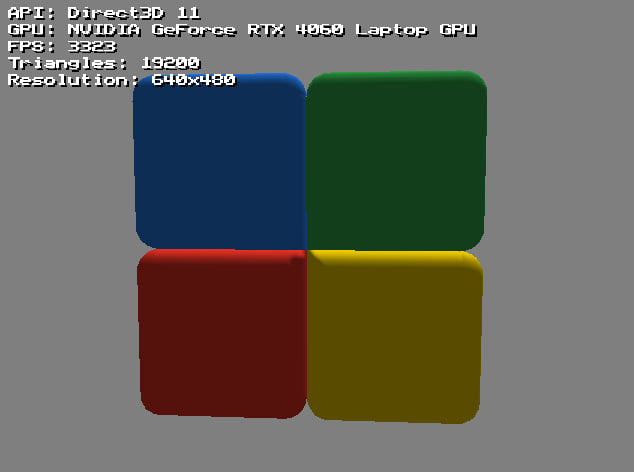
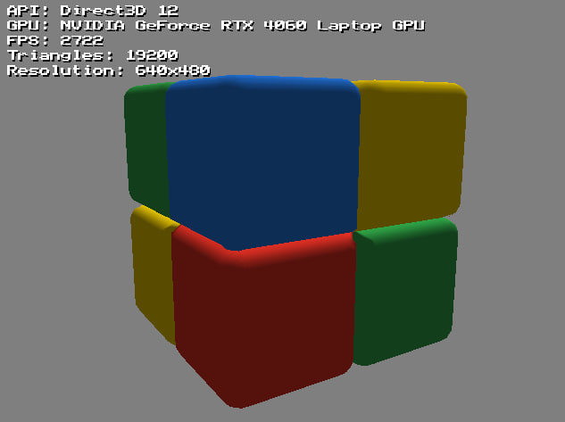
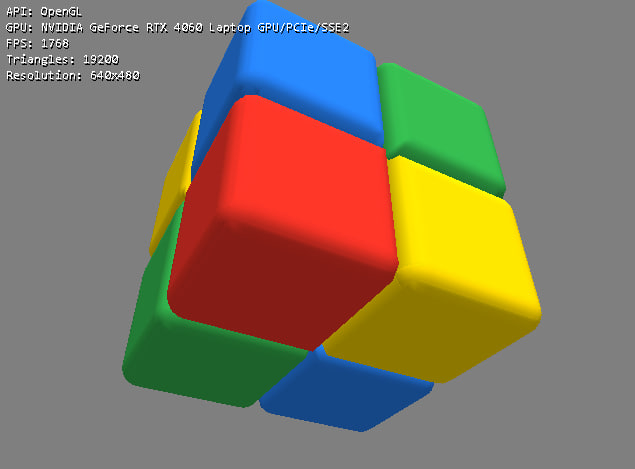
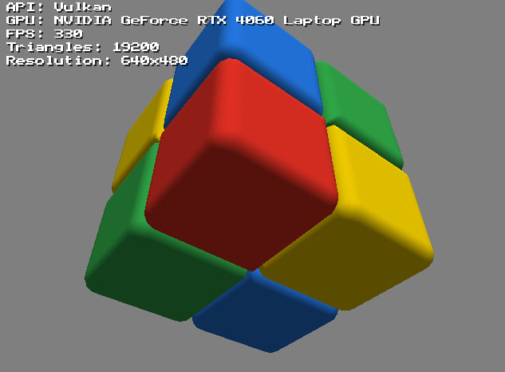
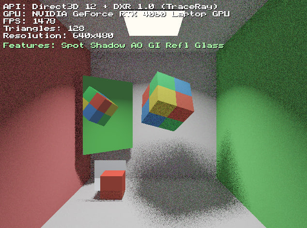
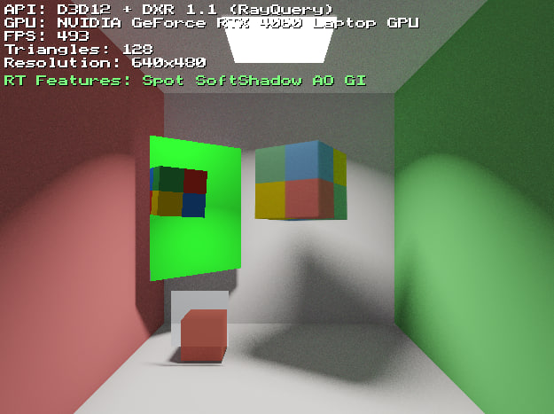
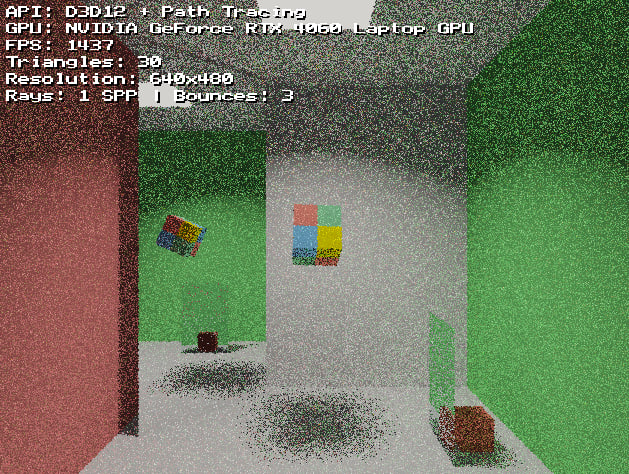
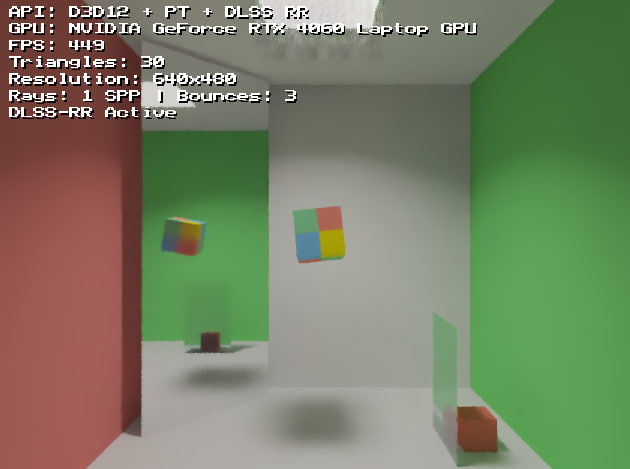
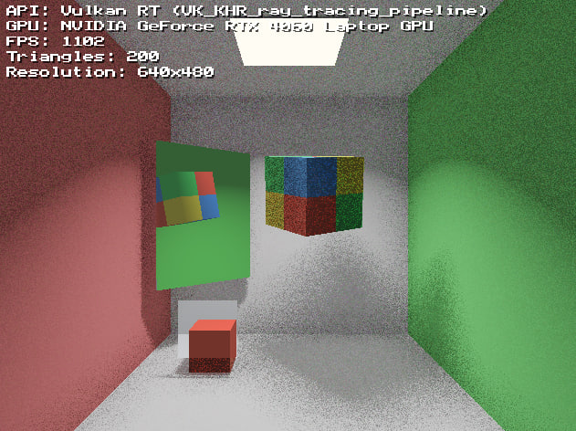

# RenderTestGPU

Multi-API Graphics Renderer demonstrating the same Cornell Box scene rendered with different graphics APIs. Supports runtime switching between renderers via dropdown menu or command line parameters.

## Supported Renderers

| Renderer | Description |
|----------|-------------|
| **Direct3D 11** | Base D3D11 rasterization renderer |
| **Direct3D 12** | Base D3D12 rasterization renderer |
| **Direct3D 12 + DXR 1.0** | Hardware ray tracing with TraceRay shaders |
| **Direct3D 12 + DXR 1.1** | Hardware ray tracing with RayQuery (inline RT) |
| **Direct3D 12 + Path Tracing** | Compute shader path tracing |
| **Direct3D 12 + DLSS** | Path tracing with NVIDIA DLSS Ray Reconstruction |
| **OpenGL** | OpenGL 4.x rasterization renderer |
| **Vulkan** | Vulkan rasterization renderer |
| **Vulkan + RT** | Vulkan ray tracing (VK_KHR_ray_tracing_pipeline) |
| **Vulkan + RayQuery** | Vulkan inline ray tracing (VK_KHR_ray_query) |

## Screenshots

### Rasterization Renderers

| Direct3D 11 | Direct3D 12 |
|:-----------:|:-----------:|
|  |  |

| OpenGL | Vulkan |
|:------:|:------:|
|  |  |

### Ray Tracing Renderers

| DXR 1.0 (TraceRay) | DXR 1.1 (RayQuery) |
|:------------------:|:------------------:|
|  |  |

| Path Tracing (DXR 1.1) | Path Tracing + DLSS Ray Reconstruction |
|:----------------------:|:--------------------------------------:|
|  |  |

| Vulkan RT (VK_KHR_ray_tracing_pipeline) | Vulkan RayQuery (VK_KHR_ray_query) |
|:---------------------------------------:|:----------------------------------:|
|  |  |

## Building

### Requirements
- Visual Studio 2018+ with C++ workload
- Windows SDK (for D3D11, D3D12)
- Vulkan SDK (for Vulkan renderers)
- NVIDIA DLSS SDK (optional, for DLSS renderer)

### Build Commands
```batch
# From rendertestgpu directory
build_release.bat    # Release build
rebuild.bat          # Full rebuild
```

Or manually with MSBuild:
```batch
"C:\Program Files\Microsoft Visual Studio\18\Community\MSBuild\Current\Bin\MSBuild.exe" rendertestgpu.vcxproj /p:Configuration=Release /p:Platform=x64
```

## Command Line Usage

Launch directly with a specific renderer (skips settings dialogs):

```batch
rendertestgpu.exe --renderer=vulkan_rt
rendertestgpu.exe -r d3d12_rt --gpu=0
rendertestgpu.exe --help
```

### Options

| Option | Description |
|--------|-------------|
| `--renderer=<type>` or `-r <type>` | Select renderer type |
| `--gpu=<index>` or `-g <index>` | Select GPU by index (0 = first) |
| `--help` or `-h` | Show help message |

### Renderer Types

| Type | Aliases | Description |
|------|---------|-------------|
| `d3d11` | - | Direct3D 11 |
| `d3d12` | - | Direct3D 12 |
| `d3d12_dxr10` | `dxr10` | D3D12 + DXR 1.0 (TraceRay) |
| `d3d12_rt` | `dxr11` | D3D12 + DXR 1.1 (RayQuery) |
| `d3d12_pt` | `pt` | D3D12 + Path Tracing |
| `d3d12_pt_dlss` | `dlss` | D3D12 + PT + DLSS |
| `opengl` | `gl` | OpenGL |
| `vulkan` | `vk` | Vulkan |
| `vulkan_rt` | `vk_rt` | Vulkan + Ray Tracing |
| `vulkan_rq` | `vk_rq` | Vulkan + RayQuery |

### Examples

```batch
# Launch Vulkan RT renderer on first GPU
rendertestgpu.exe -r vk_rt

# Launch DXR 1.0 on second GPU
rendertestgpu.exe --renderer=dxr10 --gpu=1

# Launch OpenGL
rendertestgpu.exe -r gl
```

## Directory Structure

```
rendertestgpu/
├── main.cpp                    # Window, message loop, renderer selection
├── common.h                    # Shared types, font data
├── build_release.bat           # Build script
├── shaders/
│   └── d3d11_shaders.h         # HLSL shaders for D3D11/D3D12
├── d3d11/
│   └── renderer_d3d11.cpp      # D3D11 implementation
├── d3d12/
│   ├── d3d12_shared.h          # Shared D3D12 declarations
│   ├── d3d12_globals.cpp       # D3D12 global definitions
│   ├── renderer_d3d12.cpp      # Base D3D12
│   ├── renderer_d3d12_rt.cpp   # DXR 1.1 ray tracing
│   ├── renderer_d3d12_dxr10.cpp# DXR 1.0 ray tracing
│   ├── renderer_d3d12_pt.cpp   # Path tracing
│   └── renderer_d3d12_dlss.cpp # DLSS integration
├── opengl/
│   └── renderer_opengl.cpp     # OpenGL implementation
├── vulkan/
│   ├── renderer_vulkan.cpp     # Vulkan rasterization
│   ├── renderer_vulkan_rt.cpp  # Vulkan ray tracing (VK_KHR_ray_tracing_pipeline)
│   ├── renderer_vulkan_rq.cpp  # Vulkan RayQuery (VK_KHR_ray_query)
│   ├── vulkan_shaders.h        # Pre-compiled SPIR-V (rasterization)
│   ├── vulkan_rt_shaders.h     # GLSL source for RT shaders
│   ├── vulkan_rt_spirv.h       # Pre-compiled SPIR-V (ray tracing)
│   └── vulkan_rq_shaders.h     # Pre-compiled SPIR-V (RayQuery compute)
└── bin/Release/
    └── rendertestgpu.exe       # Output executable
```

## Scene Description

The scene is a classic Cornell Box with:
- **Walls**: Red (left), Green (right), White (floor, ceiling, back)
- **Light**: Area light on ceiling with soft shadows
- **Objects**:
  - 8 rotating colored cubes (animated)
  - Angled mirror panel (reflections)
  - Glass panel (refraction with fresnel)
  - Small static red cube

## RT Features (DXR/Vulkan RT)

When using ray tracing renderers, a settings dialog allows configuring:
- **Spotlight Lighting** - Cone-shaped light with falloff
- **Soft Shadows** - Multi-sample area light shadows
- **Ambient Occlusion** - Ray-traced AO with configurable radius
- **Global Illumination** - Color bleeding from walls
- **Reflections** - Mirror surface reflections
- **Glass Refraction** - Transparent materials with fresnel

## Keyboard Controls

| Key | Action |
|-----|--------|
| `ESC` | Exit application |
| `0-6` | Debug visualization modes (DXR renderers only) |

## Log File

Errors and debug info are written to:
```
bin/Release/rendertestgpu_error.log
```

## Technical Notes

### Text Rendering
All renderers use GPU-accelerated text with an 8x8 bitmap font (128x48 texture).

### Vulkan SPIR-V
Vulkan shaders are pre-compiled to SPIR-V bytecode. To recompile from GLSL:
```batch
glslc --target-env=vulkan1.2 --target-spv=spv1.4 shader.rgen -o shader.spv
```

### Lighting Model
- Light direction: `normalize(0.2, 1.0, 0.3)` in world space
- Diffuse: `max(dot(N, L), 0) * 0.65 + 0.35` (ambient term)

## License

This is a test/demo application for learning graphics API programming.
